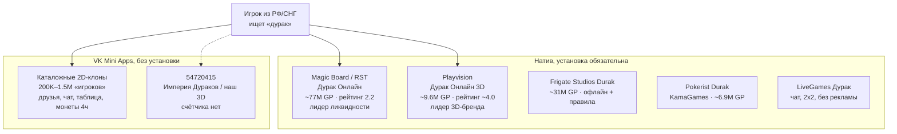

# Аналитика конкурентов: «Дурак» вокруг App ID 54720415

**Дата среза:** 19 августа 2026  
**Объект:** VK Mini App `54720415` (в каталоге VK открывается как «Империя Дураков Онлайн»; в репозитории — «Дурак Онлайн 3D»)  
**Это не бриф «мы лучше всех».** Это карта рынка, на которой нас пока почти не видно.

Цифры ниже сняты с публичных страниц в этот день. Где оценка третьей стороны — так и написано. DAU конкурентов из открытых источников **нет**; не подставлял.

---

## 1. Вердикт в одном абзаце

Рынок «Дурака» огромный и уже занят. На Google Play в России три приложения держат категорию Card: Magic Board / RST (~77 млн установок, рейтинг ~2.2), Playvision 3D (~9.6 млн, ~4.0) и Frigate (~31 млн, в основном офлайн). Во ВКонтакте десятки клонов с каталожными «игроками» от 6 тысяч до ~1.5 млн. Наш мини-апп в каталоге VK **не показывает счётчик игроков**, в Likescope его **нет**. Соревноваться с RST масштабом нельзя. Соревноваться с Playvision слоганом «у нас 3D» тоже нельзя — бренд «Дурак Онлайн 3D» уже их. Единственная реалистичная щель: **лучший дурак внутри VK WebView без установки**, с мгновенным стартом (боты как честная опция, не маскировка), друзьями из VK и столом, которому верят. Пока этого нет — 3D-стол это концепт, не продукт.

---

## 2. Как читать цифры (иначе аналитика врёт)

| Метрика | Что это на самом деле | Как не читать |
|---|---|---|
| Google Play «N млн+» | Порог установок Google, не MAU | Не равно «N миллионов активных» |
| AppBrain Installs / Recent | Оценка установок всего / за ~30 дней, срез **19.08.2026** | Не официальная цифра студии |
| RuStore «скачали за месяц» | Магазин РФ, другая база пользователей | Нельзя складывать с Play |
| VK «N игроков» на `vk.com/games/…` | Каталожный lifetime-ish счётчик VK | Это не онлайн и не DAU |
| Likescope «участники» / «популярные за сегодня» | Сторонний скрейпер каталога VK | Расходится с цифрой на странице игры; годится как порядок |
| «10 млн пользователей» в сторе RST | Маркетинговый текст разработчика | Не проверяется снаружи |
| Рейтинг стора | Смесь доверия, багов, античита и доната | 2.2 при 77 млн — сигнал недоверия, не «игра мёртвая» |

Наш `/api/metrics` считает users/dau/d1 по JSON на диске. Пока нет живого трафика и двух UTC-дней подряд, **D1 будет 0**. Это не конкурентный бенчмарк.

---

## 3. Карта рынка

Три разных продукта, которые люди называют одним словом:

1. **Сетевой дурак с живыми** — RST, Playvision, Pokerist, LiveGames, VK-клоны с комнатами.
2. **Офлайн / «против компа»** — Frigate, `app51626201` и пачка казуалок. Другой job-to-be-done: очередь в поликлинике, не «стол с друзьями».
3. **3D-премиум** — сейчас это почти монополия Playvision. Мы целимся сюда, но канал другой (VK iframe), и это надо писать в позиционировании, а не прятать.

Смежные, не дурак, но едят то же вечернее время в VK: World Poker Club (Play ~17 млн, Card RU #9), «Игровой клуб», Преферанс, Тысяча, Козёл.

---

## 4. Срез цифр 19.08.2026

### 4.1 Google Play, Россия, категория Card (AppBrain, тот же день)

| # | Игра | Студия | Оценка AppBrain | Установки (оц.) | Recent ~30д | Роль |
|---|---|---|---:|---:|---:|---|
| 1 | Durak Online | Magic Board / RST | 2.2 | 77 млн | 380 тыс. | Дефолт «поиграть по сети» |
| 2 | Durak Online 3D | Playvision | 4.0 | 9.6 млн | 140 тыс. | Дефолт «красивый 3D» |
| 3 | Durak | Frigate Studios | 4.0 | 31 млн | 260 тыс. | Дефолт «офлайн, свои правила» |
| 9 | World Poker Club | Crazy Panda | 3.9 | 17 млн | 46 тыс. | Смежный покер |
| 25 | Durak Online by Pokerist | KamaGames | 4.0 | 6.9 млн | 17 тыс. | Второй сетевой бренд |

Официальные пороги Google (страницы стора, тот же день):

- RST `com.rstgames.durak`: **50 млн+**, ~689 тыс. отзывов, last update **15 мая 2026**.
- Playvision `ru.playvision.durak`: **5 млн+**, ~136 тыс. отзывов, last update **17 августа 2026** (вчера относительно среза).

Расхождение 50 млн+ vs оценка 77 млн — нормально: Google показывает бакет, AppBrain — модель. Для решений достаточно порядка: RST на порядок больше Playvision по установкам и в ~2.5 раза больше по свежим скачиваниям.

### 4.2 RuStore (другой магазин, не складывать с Play)

| Игра | Рейтинг | Оценок | Установки | Скачали за месяц | Что видно по отзывам за август 2026 |
|---|---:|---:|---:|---:|---|
| Playvision 3D | **4.4** | 4.4 тыс. | 500 тыс.+ | 30 тыс.+ | Донат, реклама колеса, «сдача подстроена», команда в паре, отвал сети |
| RST Дурак Онлайн | **3.2** | 1.5 тыс. | 800 тыс.+ | 43 тыс.+ | VPN, валюто-продавцы, «несправедливо» |
| LiveGames Дурак | **4.9** | 259 | до 100 тыс. | нет в карточке | Малая база; хвалят UI; тот же мотив «липа в конце колоды» |

Playvision на RuStore живее RST по рейтингу, RST чуть живее по месячным скачиваниям. Оба живые. Мы в этих витринах **не представлены**.

### 4.3 VK Mini Apps (каталог `vk.com/games/…`)

«Игроков» — как написано на странице 19.08.2026:

| Страница | Название в каталоге | «Игроков» | Что продаёт текст |
|---|---|---:|---|
| [durak_igra](https://vk.com/games/durak_igra) | Дурак онлайн \| Карточная игра | **1M** | Подкидной/переводной, 24/36/52, друзья, «классная графика» |
| [app7429555](https://vk.com/games/app7429555) | Дурак онлайн | **966K** | Фильтр комнат, друзья, быстрый чат, 2–4 игрока, колода 36/52/54, монеты **каждые 4 часа**, таблица рекордов. Сообщество 14K |
| [duraktournament](https://vk.com/games/duraktournament) | Дурак онлайн | **958K** | Тот же маркетинговый текст, что у 7429555 — отдельный листинг или зеркало, не третий уникальный продукт |
| [app51417437](https://vk.com/games/app51417437) | Дурак классический | **567K** | «С реальными соперниками», описание пустое |
| [app51626201](https://vk.com/games/app51626201) | Дурак переводной и подкидной | **225K** | **Против компьютера** 2–6, скины колоды, статистика, «ничего лишнего» |
| [app51867275](https://vk.com/games/app51867275) | Карточная игра Дурак | **6K** | Режимы, ачивки, «умные оппоненты» — хвост выдачи |
| [app54720415](https://vk.com/games/app54720415) | **Империя Дураков Онлайн** | **не показано** | Страница открывается, счётчика нет |
| Likescope `5083058` | Дурак Онлайн — лучше чем покер | **1 498 167** участников; «популярные за сегодня» **1029** | Текст как у Playvision-класса: 24–52, друзья. В каталоге VK этот id не снимался напрямую |

Likescope по нашему `54720415`: **«Приложения нет»**. Либо приложение слишком новое/закрытое для их базы, либо каталог его почти не индексирует. В любом случае: **публичной аудитории, которую можно сравнить с 966K, у нас нет.**

Имя в каталоге («Империя Дураков») **не совпадает** с именем в репозитории и с поисковым запросом «дурак онлайн 3D». Playvision уже сидит на этом запросе в сторах. Это дыра в дистрибуции, не в графике.

---

## 5. Профили прямых конкурентов

### A. Magic Board / RST — «Дурак Онлайн»

Кого бьём, если говорим «сетевой дурак». Не бьём установками.

**Продукт (из стора, не выдумано):** только живые, 2–6, колоды 24/36/52, подкидной и переводной, «подкидывают соседи / все», режим шулеров, ничья, две скорости, пароль на стол, рематч тем же составом, отмена случайного броска, друзья/чат/подарки, сезонный рейтинг, ачивки, коллекции рубашек и смайлов, привязка Google/VK.

**Экономика:** фишки, премиум-столы с повышенным рейтингом, реклама, IAP. Классическая sink-петля «проиграл стол → докупи валюту».

**Почему лидер:** 12 лет в сторе (с ~2014), привычка, ликвидность, все варианты правил, которые люди спорят за кухней.

**Почему рейтинг 2.2 при 77 млн:** свежие отзывы Play/RuStore бьют в одно и то же — обрывы, «сдача не как в жизни», VPN-блок, старый UI. Игроки не уходят с рынка, они **злятся и остаются**. Это дыра доверия, не дыра спроса.

**Что у нас уже есть из их чеклиста:** подкидной/переводной, 2–6, 24/36/52, приватный стол с паролем в `RoomManager`, рематч-кнопка, daily.  
**Чего нет:** живая очередь, друзья VK, чат, «соседи vs все», undo броска, рейтинг/сезон, отмена как социальный жест.

### B. Playvision — «Дурак Онлайн 3D»

Кого бьём, если говорим «3D-стол». Они владеют названием.

**Продукт:** 3D-стол, **явно «никаких ботов»**, лиги, 50–100 анимированных смайлов, шапки, подкидной/переводной, 24/36/52. Обновляются часто (Play 17.08.2026, RuStore 4.14.0). Сообщество поддержки: `vk.com/durak_cardgame`.

**Экономика:** IAP + реклама (в т.ч. «колесо»). На RuStore за август 2026 игроки прямо называют это донатной помойкой и жалуются, что после доната «пропали козыри».

**Почему #2 в Card RU, не #20:** картинка стола продаёт установку лучше, чем RST. Рейтинг ~4.0 vs 2.2 — люди прощают донат, если стол «дорогой».

**Урок для нас:** «3D» уже занято как бренд. Копировать их манифест «только живые, никаких ботов» в пустом VK-приложении = пустые столы и отвал. Боты — наше преимущество на старте, если **не врать**, что это люди.

### C. Frigate Studios — Durak

Не сетевой конкурент. 31 млн установок, настраиваемые правила, редкая реклама, офлайн. Забирает solo-сессию. Нас это касается только так: если матч не стартует за несколько секунд, часть людей уйдёт в Frigate, а не будет ждать нашу очередь.

### D. VK-клоны 200K–1.5M

Типовой набор, который **повторяется в текстах** 7429555 / durak_igra / 5083058:

- фильтр комнаты по режиму / числу игроков / колоде;
- пригласить друга из VK;
- быстрый чат + смайлы;
- таблица рекордов день/неделя/всё время;
- монеты на таймере (4 часа — конкретная цифра у 7429555);
- 2–4 живых, не 6.

Это **минимум, без которого каталог VK не пускает в выдачу «дурак»**. У нас из этого списка в коде есть режимы и колоды; чат — toast из трёх фраз; инвайт — копирование `https://vk.com/app54720415`; лидерборда нет; бонус — суточная серия, не 4-часовой тик.

`app51626201` (225K) — отдельная ниша «потыкать бота». Мы технически ближе к ней (quick match + боты), но позиционируемся как онлайн. Смешение без честного лейбла «бот» бьёт доверие так же, как у RST бьёт «нечестная сдача».

### E. LiveGames / Pokerist

LiveGames: чат как продукт, 2×2, без рекламы, «24 млн игроков» на всю платформу (их текст, не наша проверка). На RuStore база крошечная. Pokerist: 6.9 млн GP, живой, но Recent 17K — не атакует топ. Забирать у них аудиторию «пообщаться за картами» можно только живым чатом и друзьями, не люстрой.

---

## 6. Матрица фич: они vs репозиторий 54720415

Состояние «нас» — код репозитория на дату среза (включая экономику на ветке `cursor/money-retention-679e`, PR #4). Живой `vk.ru/app54720415` может отставать, пока Railway не задеплоен.

| Возможность | RST | Playvision 3D | Типовой VK-клон | Мы |
|---|---|---|---|---|
| Подкидной + переводной | да | да | да | да |
| 24 / 36 / 52 | да | да | часто | да |
| 2–6 за столом | да | да | чаще 2–4 | да |
| Живая очередь PvP | да | да | да, если есть онлайн | нет ликвидности |
| Боты с честным лейблом | нет (гордятся) | нет (гордятся) | часть клонов | да, но легко принять за людей |
| Реконнект после сворачивания VK | ожидается у лидеров | ожидается | разное | 10 с grace (код) |
| Друзья VK / инвайт в стол | да | да | да | копирование ссылки |
| Быстрый чат / смайлы над местом | да | 50–100 анимированных | да | toast-заглушка |
| Пароль / приватный стол | да | н/д в сторе | часто | сервер умеет |
| Рематч тем же составом | да | н/д | редко в текстах | leave + quickMatch |
| Undo случайного хода | да | нет в сторе | нет | нет |
| «Соседи / все подкидывают» | да | нет в сторе | нет | нет |
| Рейтинг / лиги / сезон | да | да | таблица рекордов | winStreak в JSON, без лиги |
| Daily / квесты | daily к рейтингу | дейлики на RuStore до 21.09.2026 | монеты 4 ч | серия 7 дней + 3 квеста |
| Косметика рубашек/стола | да | шапки + смайлы | стиль колоды | каталог есть, 2 JPG + градиенты |
| Реальные платежи | IAP | IAP | VK Pay у части | заказ **pending**, фишки не выдаём |
| 3D-стол | нет | да, бренд | нет | да, WebGL в iframe |
| Старт без установки | нет | нет | **да** | **да** — единственный честный козырь канала |

Пустые клетки «н/д» — не утверждал по маркетинговому тексту.

---

## 7. Жалобы, которые повторяются у всех платных столов

Снято с первых экранов отзывов Play/RuStore 19.08.2026, не из «типичных проблем жанра».

| Мотив | RST | Playvision | LiveGames | Следствие для нас |
|---|---|---|---|---|
| Сдача «не как в жизни», нет козырей подряд | да | да | да | Не крутить скрытый pity/anti-pity. Серверный seed и без клиентского начисления. Если начнём «подкручивать новичку» — получим тот же 2.2 через полгода |
| Донат меняет удачу | да | да, в т.ч. «после первой покупки пропали козыри» | «лишь бы заплатил» | Pay только косметика + пак фишек с **серверным** callback. Не эскроу «кто больше поставил, тому карты» |
| Обрыв / лаг = проигрыш фишек | да | да | меньше | Реконнект и hold места важнее люстры. 10 с мало против 45 с из аудита |
| Реклама колеса / сериал | меньше на Play | яростно на RuStore | хвалят отсутствие рекламы | Rewarded с капом 3/день — нормально. Interstitial на ход — повтор их ошибки |
| Команда в паре, жалобы в пустоту | — | да | — | Репорт без ответа хуже, чем нет репорта |
| Нельзя настроить рубашку / старые карты | «UI 20 лет» | «дайте атласные / европейские» | — | Магазин рубашек — реальный запрос, не «ещё SKU» |

Игроки не просят «ещё шейдер». Они просят: стол не оборвался, сдача не пахнет казино, друг сел за минуту, карта отбивается та, которую ткнул.

---

## 8. Где мы выигрываем на бумаге — и где это пока фантазия

**Реальный зазор канала.** Playvision и RST требуют установку. VK-клоны — 2D. Связка «3D-стол + открыл из ленты VK без магазина» никем из топа не закрыта. Это единственное, чего у лидеров физически нет.

**Реальный зазор холодного старта.** «Никаких ботов» у Playvision работает только при тысячах онлайна. У нас онлайна нет. Quick match + бот за 2–5 с — правильный MVP, если в HUD написано «бот», не «Алексей, 34 года».

**Реальный зазор доверия (ещё не капитализирован).** RST живёт с рейтингом 2.2. Playvision живёт с обвинениями в подкрутке. Наш Pay **намеренно не выдаёт фишки** без webhook — это правильно и сейчас выглядит как «магазин сломан». Пока нет честного сообщения «деньги не начисляются, пока VK не подтвердит» и пока нет volume под JSON, зазор доверия не работает на нас.

**Фальшивые зазоры, которыми нельзя гордиться:**

- «AAA 3D» против Playvision 9.6 млн и вчерашнего патча;
- «онлайн» без друзей и без очереди;
- «экономика» без Postgres и без Pay-callback;
- название «Империя Дураков», когда все ищут «дурак».

---

## 9. Что это меняет в приоритетах (не ещё один шейдер)

Порядок — продуктовый, не календарный.

1. **Дистрибуция VK.** Имя в каталоге = поисковый запрос «Дурак». Описание как у 7429555: режимы, колода, друзья, стол. Счётчик игроков появится только после трафика; до этого страница выглядит мёртвой.
2. **Друг за 15 секунд.** `VKWebAppGetFriends` + инвайт в конкретный `roomId`, не clipboard. Без этого PvP в мини-аппе не существует, сколько ни рисуй сукно.
3. **Честный лейбл бота + умный standard-бот.** Не expert. Хватит «не рвать козыря в первой бите». Иначе соло-сессия проигрывает Frigate и `app51626201`.
4. **Чат из 8 фраз над местом.** Playvision продаёт 100 смайлов. Нам нужно 8 реплик, которые видны оппоненту. Toast «спасибо за игру» не считается.
5. **Дожать доверие.** Volume под `data/state.json` или Postgres; webhook VK Pay; реконнект ближе к 45 с; не вводить скрытую подкрутку сдачи.
6. **Не копировать sink-столы RST.** Пока нет ликвидности, эскроу ставок превратит пустой стол в «я проиграл боту 5000». Косметика + daily + rewarded cap — их рабочая модель на старте; премиум-рейтинг — когда появятся люди.
7. **3D как гигиена канала, не как стратегия.** Камера 2/6, отбой на конкретную карту, не мигание рук. Иначе Playvision выигрывает на нативе, а мы выглядим как «их пародия в браузере».

Не делать сейчас: киберпанк-колоду как якорь роста, турнир на 32, «никаких ботов», вывод фишек в рубли, войну бюджетом UA с RST.

---

## 10. Порог, после которого аналитику надо переснять

Этот документ протухнет, когда появится любое из:

- ненулевой публичный счётчик на `vk.com/games/app54720415`;
- `/api/metrics` с dau > 0 два дня подряд на проде;
- деплой Pay-webhook;
- смена имени в кабинете VK.

До тех пор сравнивать «наш DAU» с 966K каталога 7429555 — самообман.

---

## Источники (все открыты 19.08.2026)

- [AppBrain Top Free Card, Russia](https://www.appbrain.com/stats/google-play-rankings/top_free/card/ru) — дата на странице: August 19, 2026
- [RST Google Play](https://play.google.com/store/apps/details?id=com.rstgames.durak&hl=ru), [RST RuStore](https://www.rustore.ru/catalog/app/com.rstgames.durak.rustore)
- [Playvision Google Play](https://play.google.com/store/apps/details?id=ru.playvision.durak&hl=ru), [Playvision RuStore](https://www.rustore.ru/catalog/app/ru.playvision.durak)
- [Frigate Durak](https://play.google.com/store/apps/details?id=com.frigatestudios.durak)
- [LiveGames RuStore](https://www.rustore.ru/catalog/app/ru.livegames.durak)
- VK: [durak_igra](https://vk.com/games/durak_igra), [app7429555](https://vk.com/games/app7429555), [duraktournament](https://vk.com/games/duraktournament), [app51417437](https://vk.com/games/app51417437), [app51626201](https://vk.com/games/app51626201), [app51867275](https://vk.com/games/app51867275), [app54720415](https://vk.com/games/app54720415)
- Likescope: [5083058](https://apps.likescope.ru/?id=5083058&section=app), [54720415](https://apps.likescope.ru/?id=54720415&section=app) («Приложения нет»)
